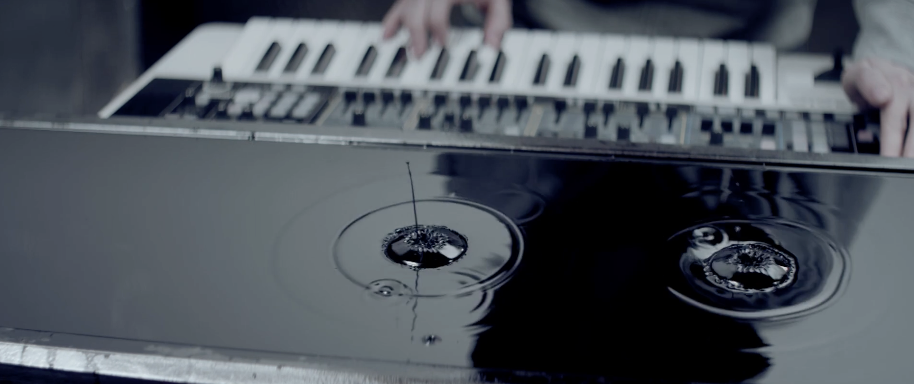
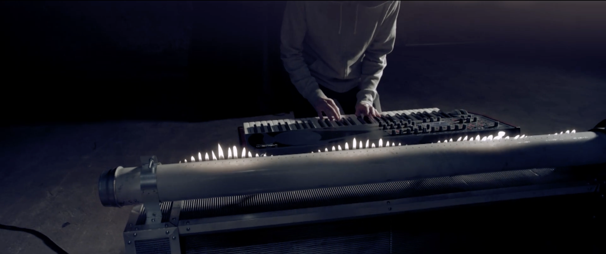
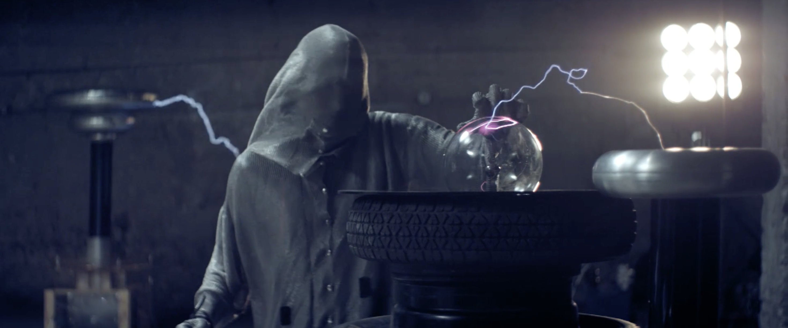
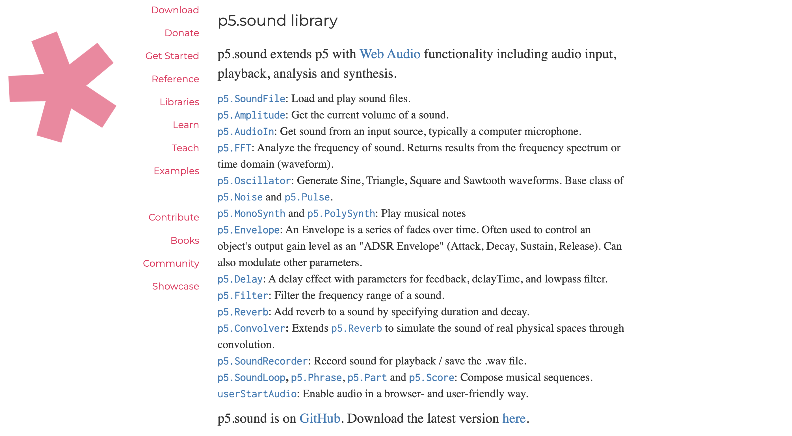

# Imaging Technique Inspiration

## Imaging Technique
Sound Visualization

## Case Study: "CYMATICS: Science Vs. Music"
Nigel Stanford's "CYMATICS: Science Vs. Music" astonishingly showcases the profound connection between sound and the physical world. In my project, I aim to adopt this technique, transforming the "noise" from the physical realm into electronic visual art. This approach allows us to perceive the commonly disdained "noise" from a fresh perspective, granting it artistic significance. Not only is this method innovative, but it also aligns well with the assignment's objectives, offering a fresh take on conventional concepts.

### Visual Representations from "CYMATICS: Science Vs. Music"

[Example video](https://vimeo.com/111593305)

# Coding Technique Exploration

## Coding Technique
p5.js-sound Library

## Technical Insight
The `p5.js-sound` library's `FFT` object can capture frequency and waveform data from sounds, enabling me to visualize audio. With this technique, I can translate real-world noises into dynamic visual representations. The relationship between sound and its visual representation becomes more direct and simplistic with this library. Furthermore, given the active p5.js community, numerous tutorials and examples are available, facilitating me.

### Visual Representation of the Technique

[Example Code](https://p5js.org/reference/#/p5.FFT)
